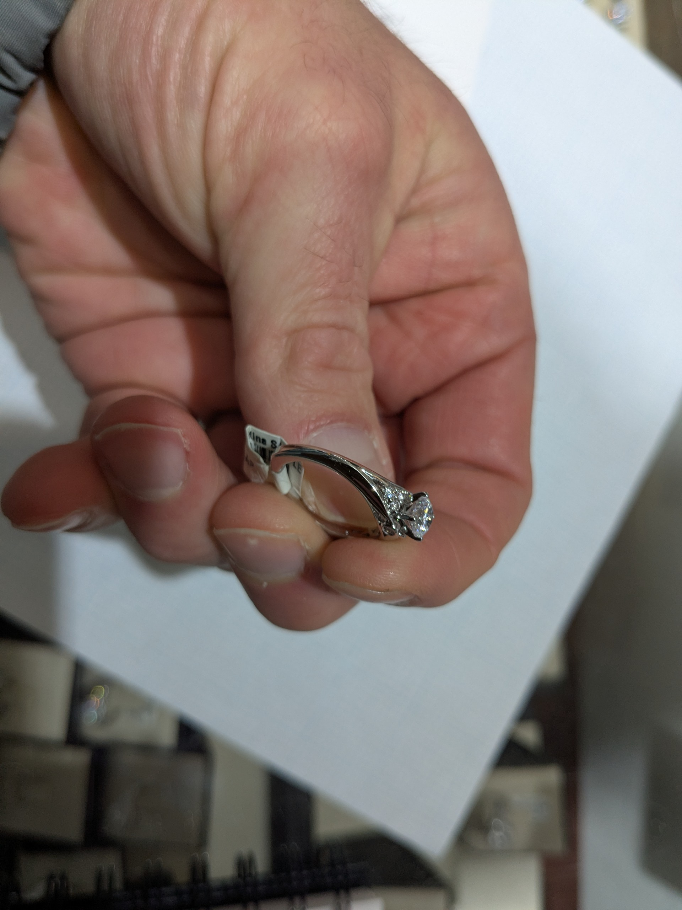
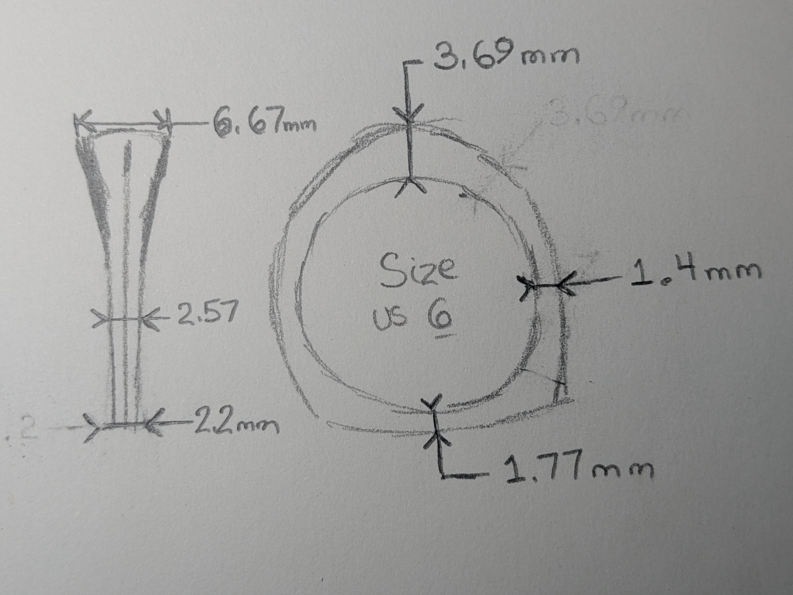
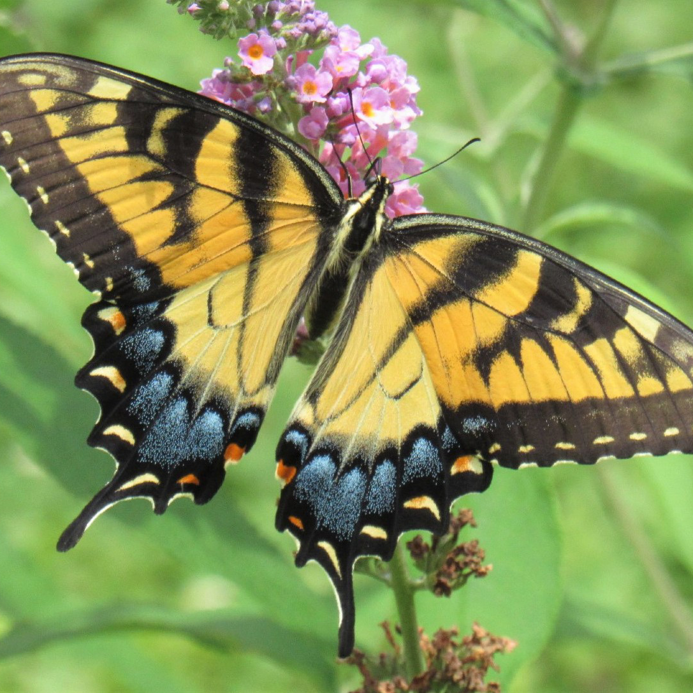
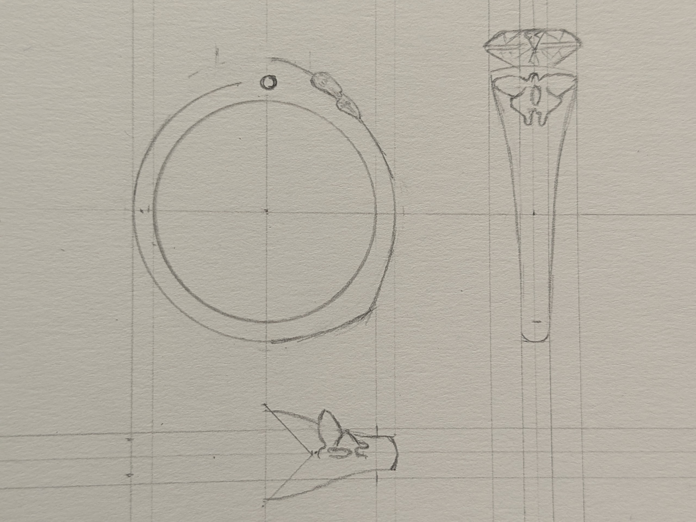
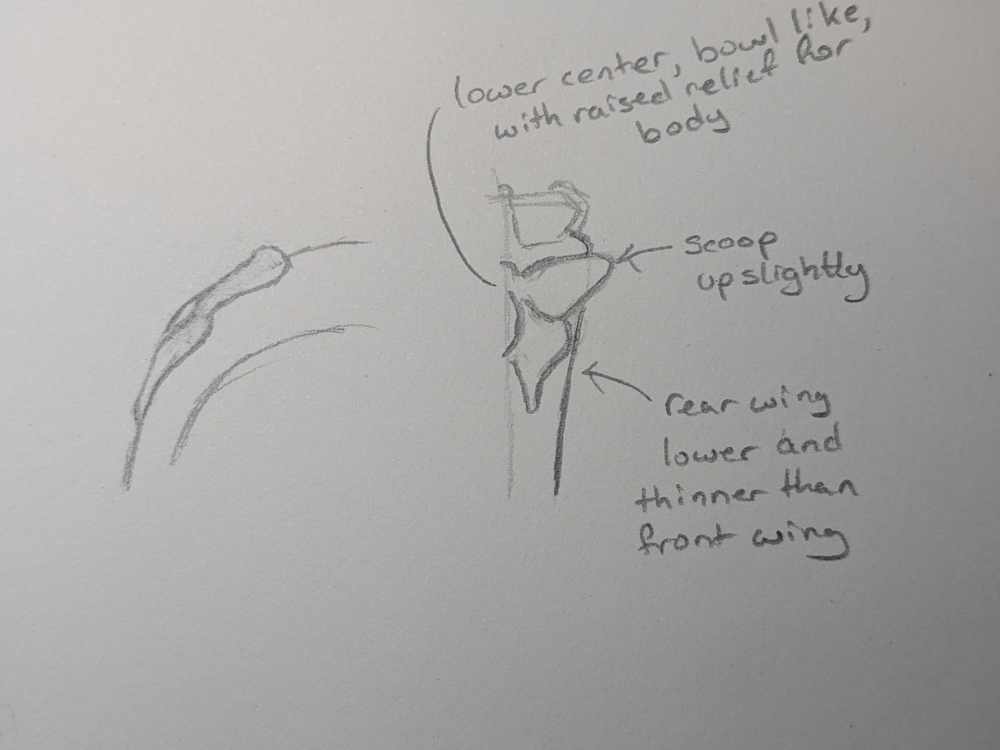
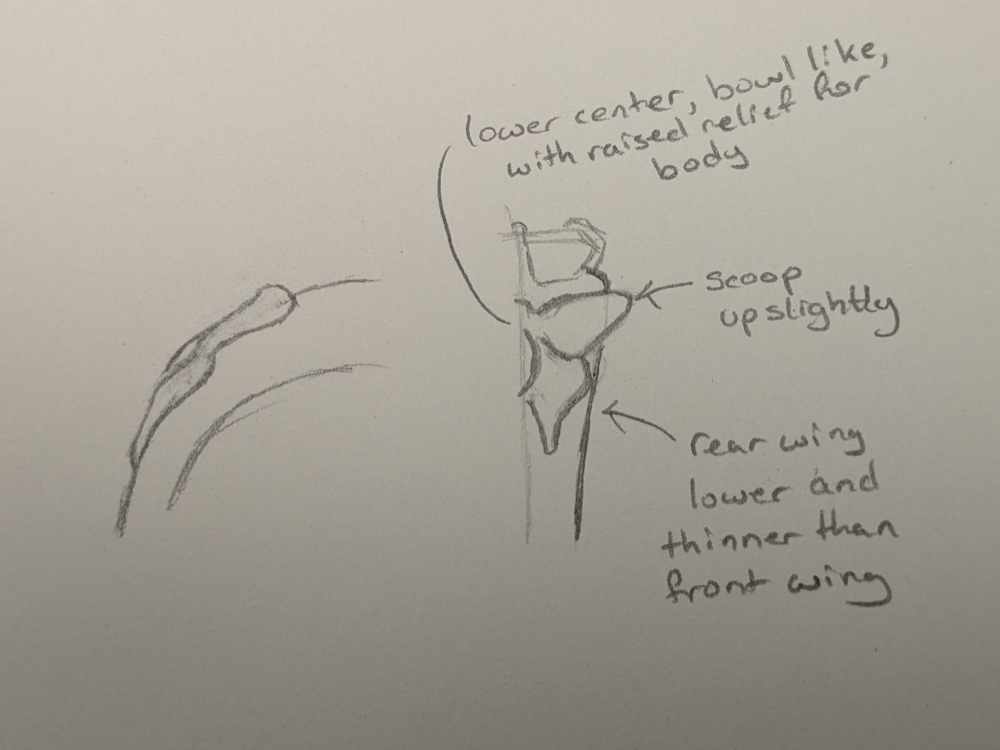

# Engagement Ring Design

## Description
A workable 3D design (STL file) for a ring with these properties. (I will have it printed and manufactured at a jeweler local to me)

- Size 5½
- European Shank
- Low profile/low set (avoid snagging)
- Solitaire stone:
  - 3/4ct princess cut
    would also like variations with:
      - 1ct princess
      - 3/4ct square cushion
      - 1ct square cushion
  - north/south set
- Butterflies (see reference photos below):
  - Formed into the band itself, raised out as a relief (not a second part soldered on).
  - The relief should have some shape to it, with the tips of the winds being higher than where they connect to the body. The body and head section should also have some dimension/relief to them as well.
    - Examples of what I mean by having dimension/relief. Would like the tips of the wings to raise up slightly, making the overall effect bowl shape
    - [Etsy Earrings 1](https://www.etsy.com/listing/8846368750
    - [Etsy Earrings 2](https://www.etsy.com/listing/814644398)
  - Ascending the band toward the solitaire, one on each side.
  - The shape of the butterflies should resemble, as closely as possible at this size, the **Eastern Tiger Swallowtail Butterfly (female)** species.
- Peakaboo diamonds:
  - round cut
  - Each is a different size and cut style (one is old, single cut)
  - I forgot to get these measured for you, will try to this evening (Wednesday, February 11, eastern US time), but, they are very small, under 2mm.
  - These are 2 different heirloom diamonds (one from each of my Grandmother's engagement rings).
  - Front and back of the band

## Reference Photos (Click on for full size)

Example of a band: 

Dimensions of a ring that she tried on and found comfortable (ignore the size 6, correct size is 5½): 

Eastern Tiger Swallowtail Butterfly (female): 
   
This is the species and gender of butterfly to model into the ring. I expect that the details of the wing notches would not work well in such small form, so simplifying is OK.

Design that I drew: 

Sketch 1: 

Sketch 2: 

